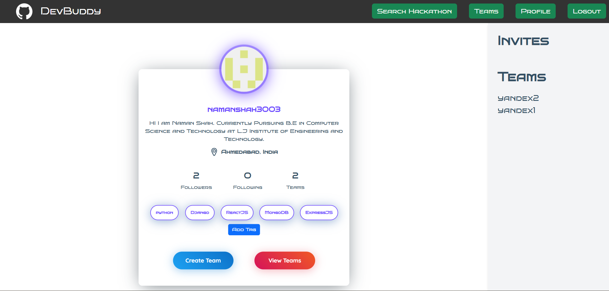

# DevBuddy
DevBuddy is a social media platform for fellow developers to collab on projects and socialise with each. Developers can login using Github accounts and make teams, register for hackathon and collaborate on team projects throught this web application.

## Tech Stack
Frontend: Html, CSS (bootstrap & tailwind), vanilla JS  
Backend: Django & Github Oauth using API  
Database: SQLite (development) & PostgreSQL (production) 

## Demo

## Features
1. Easy creation and management of your team  
2. Convenient Tracking of Project Status  
3. Socialize and Network with like-minded coders  
4. Quick, hassle-free registration to popular hackathons  
5. Uses Github integration maintaning authenticity  

## Future Scope of the Project
1. Exclusive platform for conducting hackathons  
2. Can act as a platform for interacting with like minded developers  
3. Improved project management with merge & commit support  
4. Chat appliction for team communication  